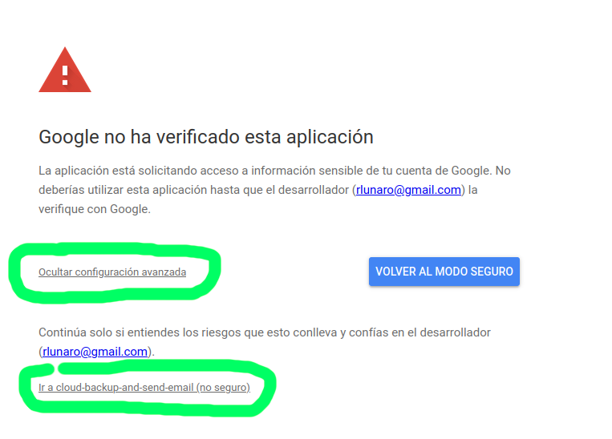
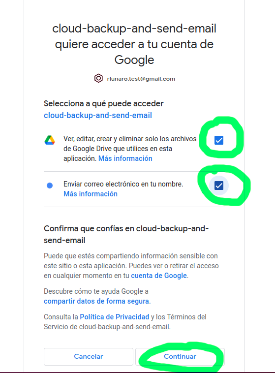
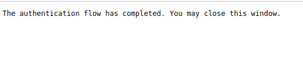

# Installation procedure

## Python 

[Python](https://www.python.org) version 3 must be installed to 
make this application work. 

Once you have python installed, I recommend to setup a virtual 
environment to make this changeMonitor working. This will avoid 
possible conflicts with dependencies from other projects. 

To do so, make sure that virtualenv is installed in your computer
by running one of the following: 

    $ virtualenv
    $ python -m venv
    
One of both above will work. After that, create a virtual environment. 
For this example we will call it ```changeMonitor```: 

    $ python -m venv changeMonitor
    
Next step is activate this virtual enviroment, by running the 
```activate``` or ```activate.bat``` command. You will see that 
this is achieved because the prompt will change: 

    $ cd changeMonitor
    changeMonitor$ source ./bin/activate 
    (changeMonitor) changeMonitor$ 
    
Now we are ready to install the google libraries for authentication
and for managing the google api:

    (changeMonitor) changeMonitor$ pip install --upgrade google-api-python-client 
    (changeMonitor) changeMonitor$ pip install google-auth-oauthlib

## We are ready for deploy the application

[Grab the latest release](https://github.com/rlunaro/google-changeMonitor/releases/)
of the application and uncompress it:

    (changeMonitor) changeMonitor$ unzip google-changeMonitor_XXXX.zip
    
## Config many things

### logging.json

The entry ```filename``` must be configured to indicate where the log files 
will be placed: 

    "filename" : "changeMonitor.log", 

By default they are left in a file calle ```google-drive.log```, but they 
can be left wherever you want. In a linux system, a good place is ```/var/log/changeMonitor```.

BTW, you can configure the maximum size of the logging file and the number 
of log files to keep. 

### config.json 

Create a ```config.json``` file by renaming the provided example-config.json:

    $ mv example-config.json config.json
    
And do the necessary configurations: 

    "emailFrom" : "YOUR GOOGLE EMAIL ACCOUNT HERE", 
    "emailTo" : ["A LIST OF EMAILS TO NOTIFY, CAN BE LEFT EMPTY"], 

**runBefore, runAfter**

These are placeholders to run additional commands that must be run 
before the backup is made and after the backup is made. You 
can leave them empty if you don't have anything to run:

  
    "//2" : "config of directories / files to backup", 
    "runBefore" : [],
    "runAfter" : [],
    
Or -let's say- you need to run a script to make a full 
backup of your database. In that case, you can place 
something like: 

    "//2" : "config of directories / files to backup", 
    "runBefore" : [ "/root/full-backup-database.sh" ],
    "runAfter" : [ "/root/clean-last-backup.sh" ],

**resourcesToBackup**

The next step is to properly configure the list of folders
or files to make backup: 

    "resourcesToBackup" : [ "/my_very_important_dir" ],

__windows users__ bear in mind you will have to use backslashes
and double backslash: 

    "resourcesToBackup" : [ "c:\\my_very_important_dir" ],
    
**verifyUploadedFiles**

__I recommend set this to "true"__: it will make an MD5 sum of the 
remote and local files and check that they match. 

**dailyPolicyFolder, monthlyPolicyFolder, yearlyPolicyFolder**

How the folders for daily, monthly and yearly copies be called. 
You can leave them as is. 

### drive_backup.sh

You have to configure properly the script ```drive_backup.sh```. Edit it, and
perform the following change: 

    drive_backup_home="PUT-HERE-THE-HOME-OF-YOUR-APPLICATION"

This is the directory where you have created the virtual environment. 

**VERY IMPORTANT:** give execution permissions to this script by running: 

   $ chmod u+x drive_backup.sh

### drive_backup.cmd

The same changes done for the linux script have to be made for the windows users
on this line: 

    set drive_backup_home=CONFIGURE HERE 
    
## And we are ready to run

Now you can run the application like this: 

    $ ./drive_backup.sh

**The first time** you run the application, it will request for permission 
to access your google drive and gmail showing a screen like this: 








	
